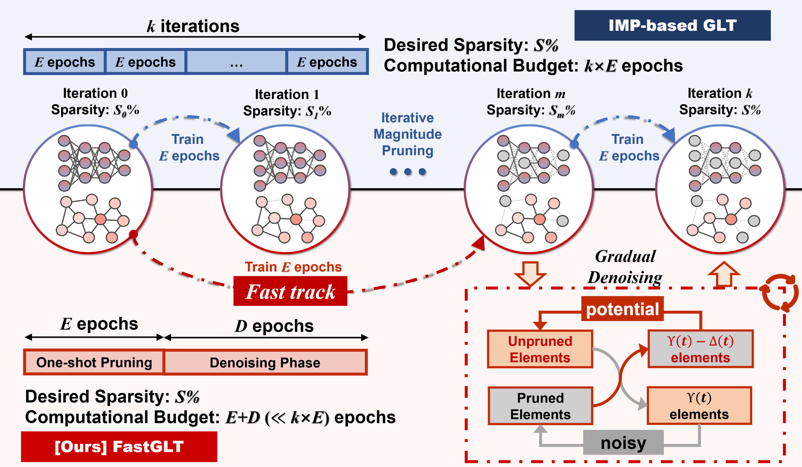

# [AAAI 2025] Fast Track to Winning Tickets:Repowering One-Shot Pruning for Graph Neural Networks
[](https://arxiv.org/abs/2412.07605)

Official codebase for paper [Fast Track to Winning Tickets: Repowering One-Shot Pruning for Graph Neural Networks](https://arxiv.org/abs/2412.07605).
## Overview
**Abstract:**
Graph Neural Networks (GNNs) demonstrate superior performance in various graph learning tasks, yet their wider real-world application is hindered by the computational overhead when applied to large-scale graphs. To address the issue, the Graph Lottery Hypothesis (GLT) has been proposed, advocating the identification of subgraphs and subnetworks, *i.e.*, winning tickets, without compromising performance. The effectiveness of current GLT methods largely stems from the use of iterative magnitude pruning (IMP), which offers higher stability and better performance than one-shot pruning. However, identifying GLTs is highly computationally expensive, due to the iterative pruning and retraining required by IMP. In this paper, we reevaluate the correlation between one-shot pruning and IMP: while one-shot tickets are suboptimal compared to IMP, they offer a *fast track* to tickets with a stronger performance. We introduce a one-shot pruning and denoising framework to validate the efficacy of the *fast track*. Compared to current IMP-based GLT methods, our framework achieves a double-win situation of graph lottery tickets with **higher sparsity** and **faster speeds**. Through extensive experiments across 4 backbones and 6 datasets, our method demonstrates 1.32%−45.62% improvement in weight sparsity and a 7.49%−22.71% increase in graph sparsity, along with a 1.7−44× speedup over IMP-based methods and 95.3%−98.6% MAC savings.


## Usage
### GCN
Please `cd FastGLT_gcn` first, then use the following commands to check the extreme graph/weight sparsity that **FastGLT** is capable of achieving. 
```
python main.py --remain 0.65 --spar_adj --num_layers 2 --dataset cora --lr 0.001 --delta 10 --accumulation-n 9 --pretrain_epoch 0 --retrain_epoch 200

python main.py --remain 0.6 --spar_adj --num_layers 2 --dataset pubmed --lr 0.001 --delta 20 --accumulation-n 3 --pretrain_epoch 50 --retrain_epoch 0

python main.py --remain 0.07 --spar_wei --num_layers 2 --dataset cora --lr 0.01 --delta 3 --accumulation-n 2 --pretrain_epoch 30 --retrain_epoch 200

python main.py --remain 0.05 --spar_wei --num_layers 2 --dataset citeseer --lr 0.01 --delta 3 --accumulation-n 2 --pretrain_epoch 30 --retrain_epoch 200

python main.py --remain 0.01 --spar_wei --num_layers 2 --dataset pubmed --lr 0.01 --delta 3 --accumulation-n 2 --pretrain_epoch 30 --retrain_epoch 200

```


### GIN
For GIN demonstration, please `cd FastGLT_gin` first. 
```
python main.py --remain 0.75 --spar_adj --num_layers 2 --dataset cora --lr 0.001 --delta 10 --accumulation-n 9 --pretrain_epoch 0 --retrain_epoch 200

python main.py --remain 0.55 --spar_adj --num_layers 2 --dataset citeseer --lr 0.001 --delta 10 --accumulation-n 9 --pretrain_epoch 0

python main.py --remain 0.4 --spar_adj --num_layers 2 --dataset pubmed --lr 0.001 --delta 10 --accumulation-n 9 --pretrain_epoch 50

python main.py --remain 0.1 --spar_wei --num_layers 2 --dataset cora --lr 0.005

python main.py --remain 0.02 --spar_wei --num_layers 2 --dataset citeseer --lr 0.005  --total_epoch 500

python main.py --remain 0.02 --spar_wei --num_layers 2 --dataset pubmed --lr 0.005 --pretrain_epoch 50

```

### GAT
For GAT demonstration, please `cd FastGLT_gat` first.
```
python main.py --remain 0.25 --spar_adj --num_layers 2 --dataset cora --lr 0.001 --delta 10 --accumulation-n 9 --pretrain_epoch 0

python main.py --remain 0.23 --spar_adj --num_layers 2 --dataset citeseer --lr 0.001 --delta 3 --pretrain_epoch 50 --retrain_epoch 200 --total_epoch 400

python main.py --remain 0.3 --spar_adj --num_layers 2 --dataset pubmed --lr 0.001 --delta 10 --accumulation-n 9 --retrain_epoch 200 --total_epoch 400 
--pretrain_epoch 30 --beta 0.5 --warmup_steps 8

python main.py --remain 0.015 --spar_wei --num_layers 2 --dataset cora --lr 0.005 --delta 10

python main.py --remain 0.01 --spar_wei --num_layers 2 --dataset citeseer --lr 0.001 --delta 3 --pretrain_epoch 50 --retrain_epoch 200 --total_epoch 400

python main.py --remain 0.01 --spar_wei --num_layers 2 --dataset pubmed --lr 0.005 --delta 10 --accumulation-n 9

```

### OGBN_arxiv
For OGBN_arxiv demonstration, execute the following commands.
```
python main.py --use_gpu --learn_t --total_epoch 500 --retrain_epoch 0 --spar_adj --remain 0.52 --pretrain_epoch 30 --num_layers 28 --delta 3 --accumulation-n 2 --lr 0.001

python main.py --use_gpu --learn_t --total_epoch 600 --retrain_epoch 0 --spar_wei --remain 0.27 --pretrain_epoch 30 --num_layers 28 --delta 3 --accumulation-n 2 --lr 0.001
```


